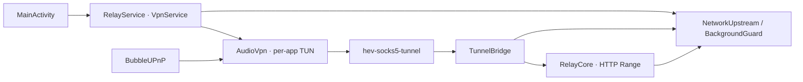

# 开发说明

## 架构


```mermaid
flowchart LR
    UI[MainActivity] --> Service[RelayService · VpnService]
    Service --> Network[NetworkUpstream / BackgroundGuard]
    Service --> VPN[AudioVpn · per-app TUN]
    Player[BubbleUPnP] --> VPN
    VPN --> Native[hev-socks5-tunnel]
    Native --> Bridge[TunnelBridge]
    Bridge --> Relay[RelayCore · HTTP Range]
    Bridge --> Network
    Relay --> Network
```

`RelayService` 管理前台会话。`AudioVpn` 在当前物理网络上解析加速域名，安装 IPv4 /32 和 IPv6 /128 路由，仅允许 BubbleUPnP 进入 TUN。地址未变时会沿用 TUN。原生引擎通过仅本机可达、每会话随机认证的 SOCKS 通道将 TCP 交给 `TunnelBridge`。匹配的 HTTP 请求直接由 `RelayCore` 在该套接字上响应，共享地址上的其他 TCP 请求绑定到物理网络原样转发。

`core` 使用纯 Java，上游通过 `RelayCore.Opener` 注入，JVM 使用合成上游。18889 回环是 Debug 专用测试入口。原生依赖版本、校验和与源码见 [app/libs](../app/libs/README.md)。

## 并发与资源

- 任务缓存由 `jobs` 锁保护，网络预检在锁外执行。同 URL 的等待者共享同一轮预检结果，失败后新的请求可以重新预检。不同 URL 可并行，创建中的任务计入最多两个任务的容量。
- 每个任务最多缓存 48 个分块，每块最多 256 KiB。两个任务的音频缓存上限合计为 24 MiB。每个读者从最多 3 块开始预取，首批请求范围内的字节校验通过后立即发送。连续发送的字节达到整块时才扩张窗口，直到连接上限对应的窗口大小。优先安排各读者最近的分块。排队时只保留分块信息，开始下载才分配字节数组，末块只取到请求所需的字节。读者离开后清理失效的预取，待在途读取结束后，每个空闲任务最多保留最近 4 块（1 MiB）。
- 全局上游配额为 1–16，包含预检。降低配额后允许已有连接完成，重试退避期间归还连接配额，空闲取流线程超时退出。
- 临时预检和分块失败最多尝试 3 次。无 `Retry-After` 的 502、503 和 504 可按原范围重试。授权拒绝、协议错误及内容范围或版本校验失败直接结束。
- `If-Range` 条件在 Range 解析前判断；过期或弱 ETag 条件返回完整内容。HEAD 忽略 Range。语义依据 [RFC 9110](https://www.rfc-editor.org/rfc/rfc9110.html#name-if-range)。
- 服务维护、网络回调、诊断写盘分别使用独立线程；停止时关闭监听、客户端、上游、任务及线程。
- 诊断有活动时每 10 秒采样，空闲时每 60 秒采样。后台调度恢复后即时采样。周期写盘只保存最近 24 条采样和 60 条事件，手动导出和停止服务时保存完整的有界历史（最多 900 条采样和 200 条事件）。诊断中的 `cached_audio_bytes` 记录当时已分配的音频缓存。
- 前台会话与监听就绪分别表示。监听失败保留开启意图，由服务自动恢复，不依赖 Activity 的 `onResume`。
- 已通过目标校验的 GET 和 HEAD 在预检前获取唤醒锁。最后一个请求结束约 8 秒后释放 CPU 唤醒锁。
- 会话只持有一个允许 Wi-Fi 或蜂窝的非 VPN 网络请求，由 Android 选择当前网络。上游 HTTP 连接绑定到该网络并使用 `Proxy.NO_PROXY`。停止服务时释放网络请求。

Media3 与 mpv 的播放器缓存可以用解码时间和缓存字节数决定何时继续加载。Rill 能观察到的是本地套接字成功发送的字节，所以使用读取位置推进窗口，并保留字节上限。rclone 也把分块尺寸和并行读流作为独立参数。联合测试中，BubbleUPnP 在开播后很快接收了大部分音频，4 路和 8 路的 CPU 采样接近。单次短样本不足以据此调低默认连接上限。 [Media3 缓冲策略](https://developer.android.com/reference/androidx/media3/exoplayer/DefaultLoadControl) · [mpv 缓存选项](https://github.com/mpv-player/mpv/blob/master/DOCS/man/options.rst) · [rclone 分块读取](https://rclone.org/commands/rclone_mount/#vfs-chunked-reading)

## 运行约定

包名为 `app.rill.android`，设置存于 `rill` SharedPreferences。诊断为 `relay-result.json`。

最低 API 29，compileSdk / targetSdk 34。版本只在根目录 `gradle.properties` 修改，诊断使用 `BuildConfig.VERSION_NAME`；健康检查返回稳定的 `Rill ready`。

## 本地检查

环境与完整构建命令见 [README](../README.md)。

```powershell
.\gradlew.bat :core:test       # JVM 回归与本地 HTTP 集成测试
.\gradlew.bat formatJava       # Google Java Format
.\gradlew.bat checkJavaFormat  # 只检查格式
.\gradlew.bat :app:connectedDebugAndroidTest
```

设备测试应在独立 Android 13+ 模拟器上运行。服务测试会修改测试应用设置、启停服务及切换 `AndroidWifi`；真实设备自动跳过服务测试。VPN 授权仅在隔离模拟器中为回归测试预置。Debug 与正式包签名不同，切换前需在独立模拟器中移除旧测试安装。

CI 对提交、PR 和版本标签运行 JVM 测试、Debug 构建、Debug / Release Lint 和格式检查，保留报告及 Debug APK 14 天。正式签名仅在发布机器配置，不上传到 CI。

改动取流行为应覆盖 Range、字节完整性、上游失败、重试和关闭。涉及 Android 生命周期的改动还应运行 [后台测试](background-testing.md)。

## 维护约定

只维护 `app/src`、`core/src` 中的现行源码；历史版本交给 Git 与 Releases。APK、缓存、SDK 路径、密钥和个人订阅均不提交。第三方许可统一存放于 `licenses/`，构建时打包进 assets。

依赖固定为 hev-socks5-tunnel 2.20.0、JUnit 4.13.2、Google Java Format 1.24.0；工具链固定为 AGP 8.7.3 / Gradle 8.9 / JDK 17。升级工具链和 targetSdk 时应独立验证行为变化。
